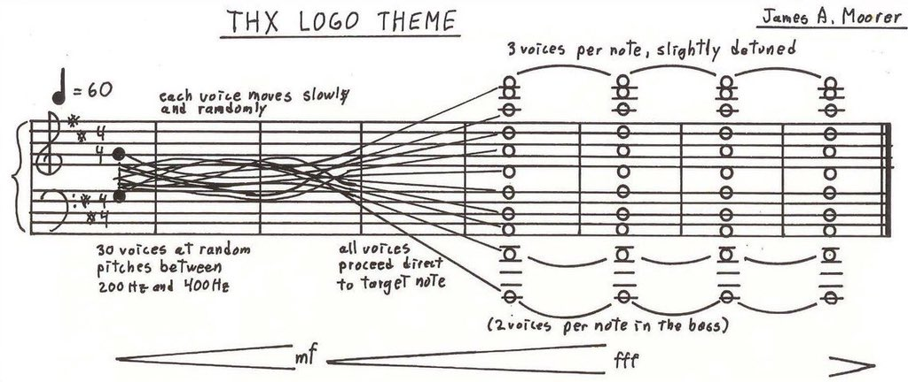

# Homework #2: Recreating the THX Deep Note 

The goal of this homework is to design a customized THX deep note. 

## Due date and deliverables
- **Oct 29, 11:59pm**
- Source code (.ipynb) and audio file (.wav): submit them to KLMS.

## Step #1: Read the following articles 
- [The Deep Story Behind DeepNote](https://www.jamminpower.org/THX.html)
- [Artful Design Excerpt: "Design of the THX Deep Note" ](https://artful.design/stuff/samples/thx.pdf)

## Step #2: Run the baseline code 
- We provide the baseline at [this link](https://github.com/juhannam/ctp431-2023/blob/main/hw2/HW2-Deep%20Note.ipynb)
- Run the code and understand how it works

## Step #3: Customize the baseline code (100 pts)
Design your own version of the THX Sound Logo by changing the following sound properties
- Frequency: make the frequency of the voices vary slowly in a random pattern at the initial stage
- Timbre: change the timber of voices using different oscillators, detuned voiced, FM synthesis, or filters
- Amplitude Envelope: change the evolution of tone dynamics
- Spatial effect: add reverberation to the tone using a room impulse response. You can find IR samples at [this link](https://www.openair.hosted.york.ac.uk/?page_id=36)   

You can also freely customize it with other options
- Change the target frequencies to build a different chord tone (e.g. Dmin, Dmaj7)
- Change the initial frequencies range 
- Adjust the number of voices (You can even gradually change the number of voices over time) 

## References
- [The original THX Deep Note](https://www.thx.com/deepnote/)
- [THX Deep Note with Dr. Andy Moorer](https://www.youtube.com/watch?v=6grjzBmHVTY) 
